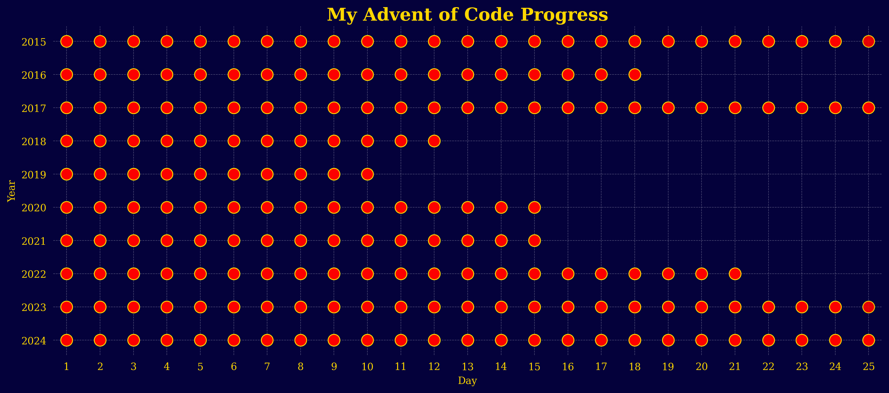

# Advent_of_Code

If you're not already familiar with this coding challenge event, you can find the website at: https://adventofcode.com/

I really like these challenges. They range from very easy to extremely hard (at least for me) and as a beginner I learned so much by giving each problem my best shot and then exploring (and being thouroughly humbled by) other people's solutions. I'll continue improving on my solutions and uploading new ones.

I also built a puzzle solving fanpage, on which you can explore all of my solutions in an interactive way:
[AoC-Puzzle-Solver](https://aoc-puzzle-solver.streamlit.app/)

